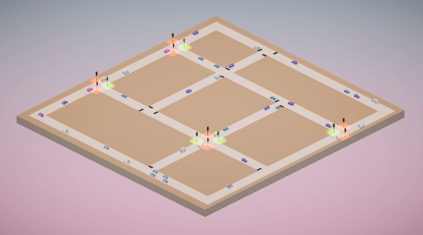
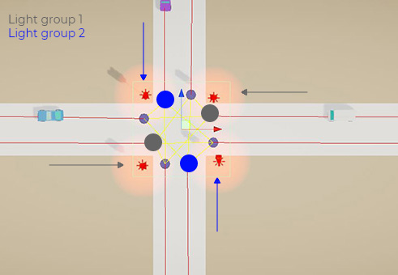

# Unity Traffic Simulation

Traffic Simulation is a Unity asset that lets you easily simulate simple traffic into your scene.

Developed / Tested with Unity 2018.3.x and plus.

## How to use
### Note
1. If you have any problem with the traffic system, press the *Re-Structure Traffic System* button on the *Traffic System* GameObject to re-generate the traffic system.
2. Make sure to be in Top Orthographic view, in the editor, when you create your waypoint system.

### Create a Traffic System
1. Create a Traffic System via *Component -> Traffic Simulation -> Create Traffic Simulation*
2. Select the *Traffic System* object in the hierarchy
3. Press *Ctrl + Left Click* to place the first waypoint of the segment (create a new segment)
4. If you press *Shift + Left Click* it will continue the segment, otherwise step 3. to create a new segment. Usually a segment stops at an intersection. **Note that the vehicle will follow the waypoints depending on the order you placed them.**
5. The next step is a bit tedious at the moment. Basically you have to link the segments between each other - so when the the segment ends at an intersection, you can go to a certain number of segments which will be picked up randomly by the VehicleAI. To do so, select a segment and plug your next segments in the *Next Segments* parameter.
6. To create an intersection, press *Alt + Left Click* and select the intersection type (stops or traffic lights).
7. Set the dimension of the intersection's box collider so it covers all the last waypoints (cf: below image). Also make sure that the height of the box collider is high enough to collide with your vehicle.

#### Editing Segments / Intersections
If you delete existing segments or intersections, you will have to press the *Re-Structure Traffic System* button in order to rebuild the system.

#### Stops
1. Select *STOP* as the intersection type.
2. If you have any, select which lanes have the priority (without stop). This means if you leave it empty every lanes will include a stop and work on a first in first out basis.

#### Traffic Lights
1. Select *TRAFFIC_LIGHT* as intersection type.
2. Configure the two light groups by placing the segment on the group they belong to. Usually, two opposite lane share the same light group. In the example below, you would have to place the two segments ending with the blue round in one group and the two segments with the gray round on the other group.

3. Changing the light of your 3D model can be done via your own script. An example of this is provided in the example folder.

### Vehicle Configuration
1. Setup your vehicle as follow (you can also refer to the vehicle in the example scene):

       -> Main object with Rigidbody + BoxCollider
          -> Object with vehicle's body mesh (without the wheels!)
          -> Empty object for the 4 wheels
             -> Object with WheelCollider (but no mesh)
             -> Object with WheelCollider (but no mesh)
             -> Object with WheelCollider (but no mesh)
             -> Object with WheelCollider (but no mesh)
2. Select the vehicle object main parent and click on *Component -> Traffic Simulation -> Setup Vehicle*. This will add the needed scripts, set the proper layers and tag as well as create a raycast anchor.
3. Place the raycast anchor in the front of the vehicle's hood.
4. Configure *WheelDrive* and *VehicleAI* with your wanted paramters (torque, maximum speed, etc.). Set the left and right wheel mesh - they will be instantiate in runtime where your wheelcolliders are located.

---

MIT License

Copyright (c) 2019 Matthieu Cherubini

Permission is hereby granted, free of charge, to any person obtaining a copy of this software and associated documentation files (the "Software"), to deal in the Software without restriction, including without limitation the rights to use, copy, modify, merge, publish, distribute, sublicense, and/or sell copies of the Software, and to permit persons to whom the Software is furnished to do so, subject to the following conditions:

The above copyright notice and this permission notice shall be included in all copies or substantial portions of the Software.

THE SOFTWARE IS PROVIDED "AS IS", WITHOUT WARRANTY OF ANY KIND, EXPRESS OR IMPLIED, INCLUDING BUT NOT LIMITED TO THE WARRANTIES OF MERCHANTABILITY, FITNESS FOR A PARTICULAR PURPOSE AND NONINFRINGEMENT. IN NO EVENT SHALL THE AUTHORS OR COPYRIGHT HOLDERS BE LIABLE FOR ANY CLAIM, DAMAGES OR OTHER LIABILITY, WHETHER IN AN ACTION OF CONTRACT, TORT OR OTHERWISE, ARISING FROM, OUT OF OR IN CONNECTION WITH THE SOFTWARE OR THE USE OR OTHER DEALINGS IN THE SOFTWARE.

# 기존 프로젝트에서 차량 수에 따른 신호등 알고리즘 변환 과정 추가

+ GetGroupVehicleCount(), IsVehicleInGroup(), Start(), SwitchLights(), SwitchLightsCoroutine(), MoveVehiclesQueue(), OnTriggerEnter(), OnTriggerExit(), TriggerLight(), ExitLight() 함수 추가 및 수정

+ 결론적으로 기존 신호등같이 2개씩 바뀌는게 아닌 하나씩 바뀐다.

+ 신호등마다 텍스트를 추가하여 차량이 교차로를 통과한 횟수를 시각적으로 보여줌. 이 경우 ExitLight 함수를 통해 차량이 교차로에서 벗어난 순간 Count 를 늘려 UI Text 를 업데이트.

## 1분간 알고리즘 미적용한 경우 통과 차량수(46, 49)

## 1분간 알고리즘 적용한 경우 통과 차량수(48, 59)

## 2분간 알고리즘 미적용한 경우 통과 차량수(88, 91, 101)

## 2분간 알고리즘 적용한 경우 통과 차량수(101, 111, 114)

## 3분간 알고리즘 미적용한 경우 통과 차량수(141)

## 3분간 알고리즘 적용한 경우 통과 차량수(175)

## 종합 표

### 평균적으로 알고리즘을 적용한 모델에서 교차로를 통과한 차량 대수가 약 17.6% 향상된 모습. 중요한 것은, 1분 2분 3분으로 갈수록 점점 더 통과한 차량의 수의 차이가 커지는 모습. 유의미한 차이가 있는것을 확인할 수 있음.

Demo 동영상 youtube 링크 : https://youtu.be/pyV5lJHHgT4

